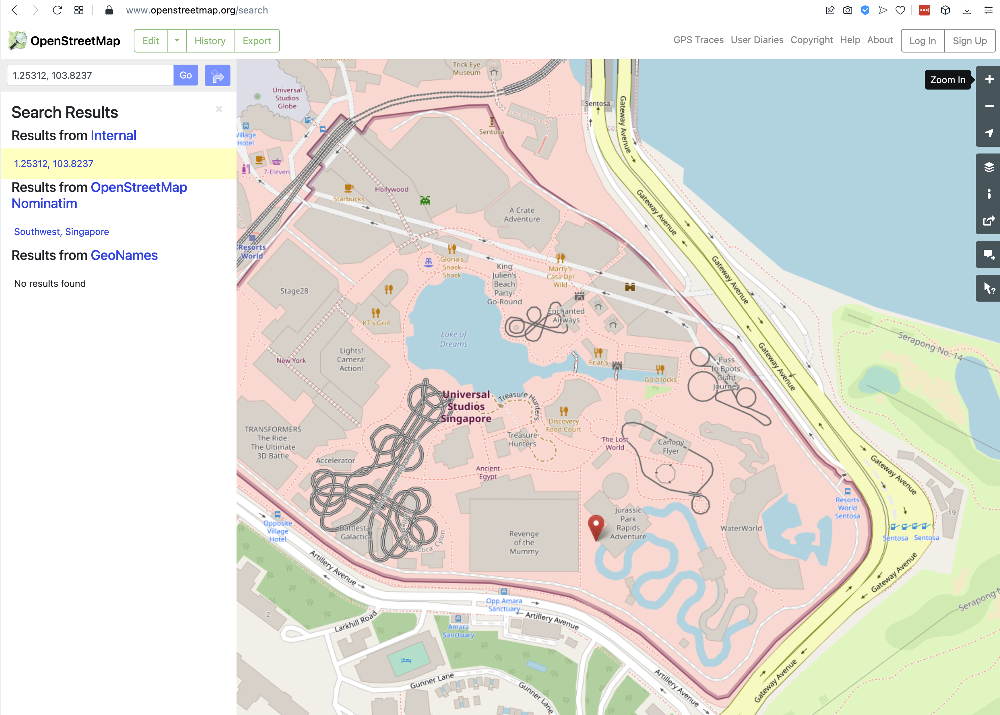

# 1. Loading Data

## 1.1 Raw1

```{r}
sin_listing <- read.csv("./data/sin_listings.csv")
```

## 1.2 Data Wrangling
This is a function that wrangles AirBnb data into an analysable chunk. Because we will be doing the same for multiple cities, we will do a function out of this. The function is based on top of code shared in the lecture for Module 2.

```{r}
library(dplyr)
library(stringr)
library(readr)
library(stargazer)
library(knitr)

wrangle_airbnb_dataset <- function (raw_listing_full)
{
  listing.raw <- raw_listing_full  %>% 
                select(price,number_of_reviews,beds,bathrooms,accommodates,reviews_per_month, property_type, room_type,review_scores_rating, neighbourhood_cleansed, neighbourhood_group_cleansed, latitude, longitude) %>% 
                rename(Reviews = number_of_reviews) %>% 
                rename(Beds = beds) %>% 
                rename(Baths = bathrooms) %>% 
                rename(Capacity = accommodates) %>% 
                rename(Monthly_Reviews = reviews_per_month) %>% 
                rename(Property_Type = property_type) %>% 
                rename(Room_Type = room_type) %>% 
                rename(Price = price) %>% 
                rename(Rating = review_scores_rating) %>%
                rename(Neighbourhood = neighbourhood_cleansed) %>%
                rename(Region = neighbourhood_group_cleansed)


  listing.raw <-  listing.raw %>% 
                mutate(Price = str_replace(Price, "[$]", "")) %>% 
                mutate(Price = str_replace(Price, "[,]", "")) %>% 
                mutate(Price = as.numeric(Price)) %>% 
                mutate(Room_Type = factor(Room_Type, levels = c("Shared room", "Private room", "Entire home/apt"))) %>% 
                mutate(Capacity_Sqr = Capacity * Capacity) %>% 
                mutate(Beds_Sqr = Beds * Beds) %>% 
                mutate(Baths_Sqr = Baths * Baths) %>% 
                mutate(ln_Price = log(1+Price)) %>% 
                mutate(ln_Beds = log(1+Beds)) %>%
                mutate(ln_Baths = log(1+Baths)) %>% 
                mutate(ln_Capacity = log(1+Capacity)) %>% 
                mutate(ln_Rating = log(1+Rating)) %>% 
                mutate(Shared_ind = ifelse(Room_Type == "Shared room",1,0)) %>% 
                mutate(House_ind = ifelse(Room_Type == "Entire home/apt",1,0)) %>% 
                mutate(Private_ind = ifelse(Room_Type == "Private room",1,0)) %>% 
                mutate(Capacity_x_Shared_ind = Shared_ind * Capacity) %>% 
                mutate(H_Cap = House_ind * Capacity) %>% 
                mutate(P_Cap = Private_ind * Capacity) %>% 
                mutate(ln_Capacity_x_Shared_ind = Shared_ind * ln_Capacity) %>% 
                mutate(ln_Capacity_x_House_ind = House_ind * ln_Capacity) %>% 
                mutate(ln_Capacity_x_Private_ind = Private_ind * ln_Capacity)

  return(listing.raw)
}

sin_listing.clean <- wrangle_airbnb_dataset(sin_listing)
head(sin_listing.clean)
```

## 1.3 Outlier Detection
We will now check out outliers in our data for various parameters.

```{r}
generate_price_boxplot <- function (listing.clean, city, comparison_col = "")
{
  # png(file = "./graphs/boxplot.png")
  if (comparison_col == "")
  {
    boxplot(listing.clean$Price, data = listing.clean, ylab="Price", main=paste("Boxplot: Price for", city))
  }
  else
    boxplot(listing.clean$Price ~ listing.clean[[comparison_col]], data = listing.clean, ylab="Price", xlab=comparison_col, main=paste("Boxplot: Price vs", comparison_col, "for", city))
  # dev.off()
}

generate_price_boxplot(sin_listing.clean, "Singapore") #, sin_listing.clean$)
generate_price_boxplot(sin_listing.clean, "Singapore", "Room_Type") #, sin_listing.clean$)
generate_price_boxplot(sin_listing.clean, "Singapore", "Property_Type") #, sin_listing.clean$)
generate_price_boxplot(sin_listing.clean, "Singapore", "Capacity") #, sin_listing.clean$)
generate_price_boxplot(sin_listing.clean, "Singapore", "Beds") #, sin_listing.clean$)
generate_price_boxplot(sin_listing.clean, "Singapore", "Region") #, sin_listing.clean$)
```
That was a visual analysis of outliers. Clearly, there are a few offerings that are very highly priced. Let's look at them in a bit more depth, especially those units with rental prices above $5000. 

```{r}
filter(sin_listing.clean, Price > 5000)
```

The listing for Southern Islands was curious enough for us to want to look it up on a map. 



The given coordinates point to a location in Universal Studios Singapore, specifically the Jurassic Park Rapids Adventure ride. Now the price to USS is indeed expensive, and the Jurassic Park Rapids Adventure ride is a family favourite, but whether it is worth spending $8,900 to spend a night there may indeed be debatable. 

Realistically however, we suspect this is a listing from somewhere further south at Sentosa Cove, an exclusive community designed for high net-worth individuals. 


Which is a great lesson for analysing place data from Singapore. We are a very compact country, and a few decimal points' worth of difference in lat-long coordinates can indeed be the difference between a much loved amusement part ride or a high-end dwelling.


```{r}
library(car)
library(ggplot2)
library(stringr)
library("ggExtra")
library(psych)

sin_listing.clean <-sin_listing.clean %>%
              dplyr::filter(Price < 1000, !is.na(Price)) %>%
                dplyr::filter(Capacity < 9) %>%
                mutate(ln_Reviews = log(1+Reviews)) %>%
                mutate(ln_Monthly_Reviews = log(1+Monthly_Reviews))
sin_listing.clean
```

```{r}
lm0 <- lm(Price ~ Capacity, data = sin_listing.clean)
summary(lm0)
stargazer(lm0, type = "text")

ggplot(data = sin_listing.clean, aes(x = Capacity, y = Price)) + geom_point(aes(size=3)) +
scale_colour_hue(l=50) + # Use a slightly darker palette than normal
geom_smooth(method=lm,   # Add linear regression lines
           se=TRUE,    #  add shaded confidence region
           fullrange=TRUE) +
theme(axis.text.x = element_text(size=15), axis.text.y = element_text(size=15), 
        axis.title=element_text(size=15,face="bold"))
# vif(lm0)
```
```{r}

# The moderating effect of type of room. Lets model that.

lm1 <- lm(Price ~ Private_ind + House_ind, data = sin_listing.clean)
summary(lm1)
stargazer(lm1, type = "text")
```
```{r}
#Regression with Capacity and Dummy Variables for type of room:

lm2 <- lm(Price ~ Capacity + Private_ind + House_ind, data = sin_listing.clean)
summary(lm2)
stargazer(lm2, type = "text")
```

```{r}
#Regression with Capacity,Dummy Variables and interaction between the two:
lm3 <- lm(Price ~ Capacity+Private_ind + House_ind+P_Cap+H_Cap, data = sin_listing.clean)
summary(lm3)
stargazer(lm3,type = "text")

```
```{r}
# la_listing <- la_listing %>%
#               dplyr::filter(Price < 5000 , !is.na(Beds), !is.na(Baths), !is.na(Price), !is.na(Rating)) %>%
#                 dplyr::filter(Capacity < 9) %>%
#                 mutate(ln_Reviews = log(1+Reviews)) %>%
#                 mutate(ln_Monthly_Reviews = log(1+Monthly_Reviews))
```